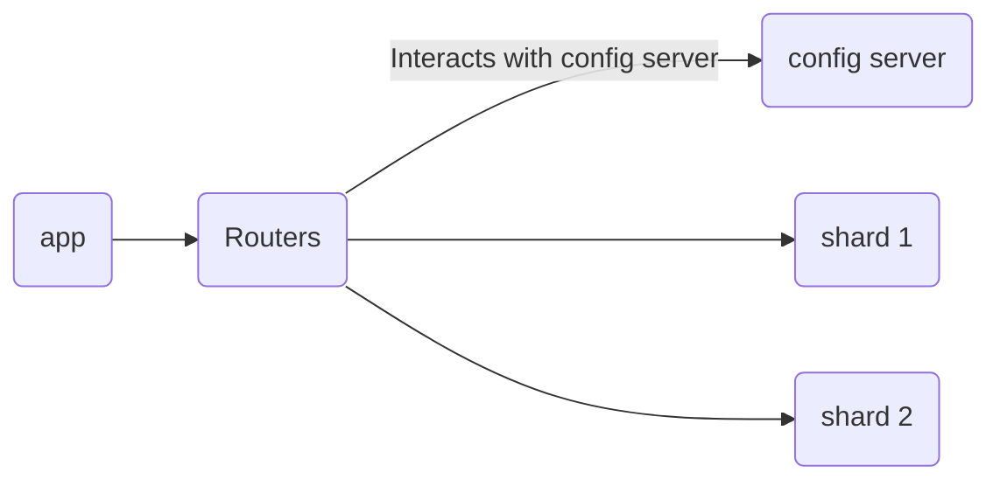

# Introduction to MongoDB
MongoDB is the most popular and most used document-based NoSQL database solution.  

It provides a feature-rich development experience and it's own data platform that provides a lot of built-in features and services that make MongoDB a solid choice for modern apps and services.

> MongoDB is a non-relational database that can also handle relational data as well.

## Use cases
When it first launched, MongoDB was used in only simple projects or projects that were very niche and didn't need to scale at all. In the current time, MongoDB is used by almost all kinds of  industries by all kinds of companies that store different kinds of data in their MongoDB clusters.

MongoDB Atlas, the cloud platform for MongoDB is used by millions of users that all store and work with their data on the Atlas platform that also provides analytics and real-time overview of the data as well.

## Reasons for popularity
MongoDB provides a great developer experience with a scalable and developer friendly way of storing data based on JSON.

- MongoDB doesn't follow any strict schema rules like relational databases so it's an ideal choice for storing un-structured and semi-structured data.
- MongoDB Atlas provides highly scalable production ready deployments for large-scale applications as well as a generous free-tier for testing and development purposes.
- MongoDB offers a powerful query language and indexing capabilities, simplifying common operations.
- MongoDB documents store data in JSON-like format that most developers are already familiar with.
- MongoDB provides a hassle free and quick setup experience you can create your database and connect you app to it in just 15 minutes.

MongoDB also offers a huge suite of libraries and drivers for all most all popular programming languages so it doesn't matter which language your app is written in it can connect to MongoDB easily.

> The MongoDB Atlas Data Platform removes all the worries of setting up a database deployment, monitoring, and analytics.

Atlas offers a completely managed database solution so that you can focus on development tasks rather than setting up infrastructure.

## Powerful and easy to use
At it's heart, MongoDB is a distributed system that was originally designed to be run with a default configuration inside replica sets known as clusters.

The default configuration of MongoDB provides a three-node replica set. All three nodes are data-bearing,  which means that there is a complete copy of the database available on each node.

Each database  is hosted on a separate instance or host, which can be in the same availability zone, data center, or  region. This default configuration is to ensure both redundancy and high availability.

## Node replication using RAFT
Whenever something is written into the primary node, its also written to the secondary nodes as well. This process is known as replication and due to it even if the primary node is lost the data will still be available in the backup nodes.

While MongoDB uses the RAFT protocol for leadership decisions like picking the main database (primary node), it adds its own twist.

Traditionally, RAFT picks leaders randomly. But MongoDB considers each server's importance (priority), how up-to-date its data is, and how quickly it responds when picking the new leader. So, it's like an election where votes depend on experience and speed, not just luck.

Not all servers in MongoDB write at the same time. This delay depends on how far apart they are, their internet speed, and how busy they are. If one server falls behind, it uses a special log (oplog) to catch up to the others.

MongoDB keeps an eye on how far behind each server is and can even step in if the delay gets too big. This way, your data stays safe and consistent even if things slow down a bit.

For massive datasets spread across the globe, you can split your data into smaller, replicated chunks stored in different places (sharded cluster). 

> Each chunk is like a smaller, 3-copy database itself (replica sets within the cluster).

Think of it as distributing your belongings across safe deposit boxes in different cities for maximum security and accessibility.

